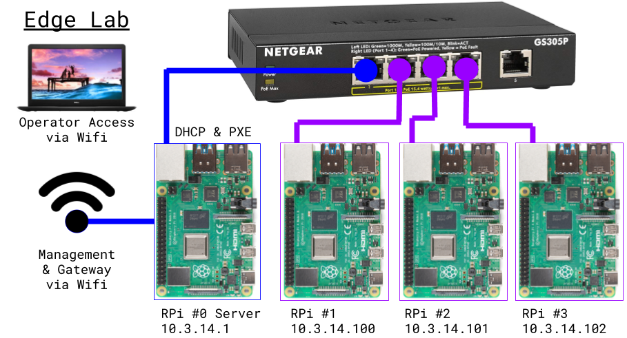

Edge Lab (edgelab.digital)
============

***TL;DR: [four RPis](bill_of_materials.md) self-building an autonomous PXE-boot cluster in 15 minutes.***

Welcome to a great place to start you journey into Edge Infrastructure!

This open reference architecture describes the requirements, usage, engineering, and community actions needed to bring your personal Edge Lab to life.

Ready to go?  Order [these items](bill_of_materials.md) and follow [these directions](assembly.md).

What is Edge Lab?
-----

It is an inexpensive multi-node environment to serve as a development platform for edge use cases. The design includes completely automated operation to practice the zero-touch remote operation and basic infrastructure as code (IaC) capabilities required for real environments. While we use RPi as a base reference, it is NOT RPi specific.

Note: we're not trying to define "what is edge" here!  You're free to leverage the designs and automation in anyway that fits your infrastructure needs.

Participating
-----

The Edge Lab is an open source reference architecture in the Digital Rebar Platform (DRP) ecosystem.   Everyone is welcome to use and contribute to the APLv2 documentation here and supporting [DRP ecosystem catalog](https://github.com/digitalrebar/provision-content).

Until there is a dedicated Edge Lab channel, questions should be addressed to [RackN Edge Lab team](mailto:edgelab@rackn.com) or posted on the Digital Rebar #community channel at [rackn.slack.com](http://rackn.com/support/slack).

Multi-Vendor / Portable Resource
----

The Edge Lab is a multi-contributor platform where different projects and vendors can work to build integrated operational stacks. By building components in a modular way so users can quickly assemble a functional lab.

The Edge Lab site is a multi-component reference architecture; consequently, this site is *not* a code collection point.

The initial target for the Edge Lab is as a [k3s cluster](https://k3s.io/) managed by [Digital Rebar](rebar.digital).

Requirements
---

The minimum configuration for the Edge Lab is four Rasberry Pi (RPi 4B) cluster described under the [Bill of Materials](bill_of_materials.md) and available for under $500 US.  Non-RPi and Cloud configurations will also work!

If you have the [materials](bill_of_materials.md) available and [assembled](assembly.md), please review the [Bootstrapping Guide](bootstrapping.md) page for instructions on how to configure the environment.

Audience
----

Edge Lab is designed for technology professionals who are experienced with building operational environments.

As a lab, it is expected to be deployed on desktop for short to mid term project work.  It should work equally well at home, conference and office environments where Wifi is managed by simple password requirements without a proxy or interstitial page (e.g. coffee shops and airplane). 

Network Architecture
----

The Edge Lab is designed to operate within an isolated physical network that uses the management node (RPi #0) as an internet gateway.  RPi #0 must have access to Wifi with internet access since it will be configured to forward internet requests from the nodes.  This design ensures consistent and performant networking within the cluster.  It also reduces the risk of specialized lab activity, such as DHCP and network booting, from interfering with other systems.

In this configuration, the API of the management system will be accessible via the Wifi interface for remote operation.  Once the Wifi configuration is complete via terminal or keyboard, no other direct connection to the lab is required.

Note: There are no out of band management capabilities.  Resets will rely on using the Digital Rebar Runner soft reboot or a manual power reset.  For this reason, ALL Edge Lab configurations will NOT rely or require out of band management APIs.
