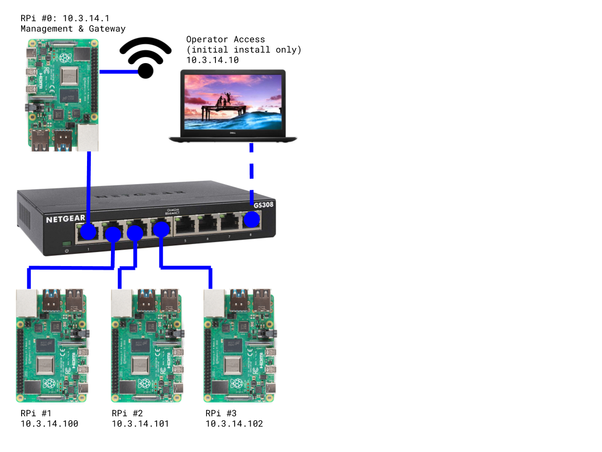

Edge Lab (edgelab.digital)
============

Welcome to the journey into the Edge Infrastructure community!

This site is primarily documentation that describes the Edge Lab requirements, usage information, engineering, and community actions needed to bring Edge Lab to life.

What is Edge Lab?
-----

It is an inexpensive multi-node environment to serve as a development platform the edge use cases. The system has completely automated operation to practice the zero-touch remote operation and basic infrastructure as code (IaC) capabilities required for real environments,

Note: we're not trying to define "what is edge" here!  You're free to leverage the designs and automation in anyway that fits your infrastructure needs.

Participating
-----

The Edge Lab an open source community project being organized by RackN under the APLv2 parts of the Digital Rebar project.   Everyone is welcome to use and contribute to the project.

Until there is a dedicated project liaison, questions should be addressed to [eng@rackn.com](mailto:eng@rackn.com) or posted on the #community channel at [rackn.slack.com](http://rackn.com/support/slack).

Multi-Vendor / Portable Resource
----

The Edge Lab is a multi-contributor platform where different projects and vendors can work to build different operational stacks. Each is available in a modular way so users can quickly assemble a usable lab.

This website provides links to the necessary resources.  Edge Lab is a multi-component system, this site is *not* a code collection point.

The initial target for the Edge Lab is as a [k3s cluster](https://k3s.io/) managed by [Digital Rebar](rebar.digital).

Requirements
---

The minimum configuration for the Edge Lab is four Rasberry Pi (RPi 4B) cluster described under the [Bill of Materials](bill_of_materials.md) and available for under $500 US.  Non-RPi and Cloud configurations will also work!

If you have the materials available, please review the [Bootstrapping Guide](bootstrapping.md) page for instructions on how to configure the environment.

Audience
----

Edge Lab is designed for technology professionals who are experienced with building operational environments.

As a lab, it is expected to be deployed on desktop for short to mid term project work.  It should work equally well at home, conference and office environments where Wifi is managed by simple password requirements without a proxy or interstitial page (e.g. coffee shops and airplane). 

Network Architecture
----

The Edge Lab is designed to operate within an isolated physical network that uses the management node (RPi #0) as an internet gateway.  RPi #0 must have access to Wifi with internet access since it will be configured to forward internet requests from the nodes.  This design ensures consistent and performant networking within the cluster.  It also reduces the risk of specialized lab activity, such as DHCP and network booting, from interfering with other systems.

In this configuration, the API of the management system will be accessible via the Wifi interface for remote operation.  Once the Wifi configuration is complete via terminal or keyboard, no other direct connection to the lab is required.

Note: There are no out of band management capabilities.  Resets will rely on using the Digital Rebar Runner soft reboot or a manual power reset.  For this reason, ALL Edge Lab configurations will NOT rely or require out of band management APIs.
